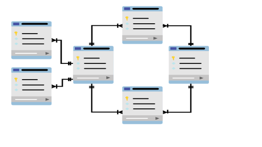
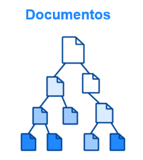
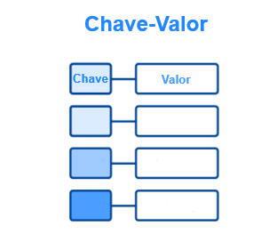
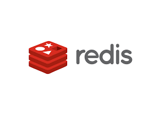
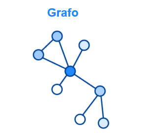
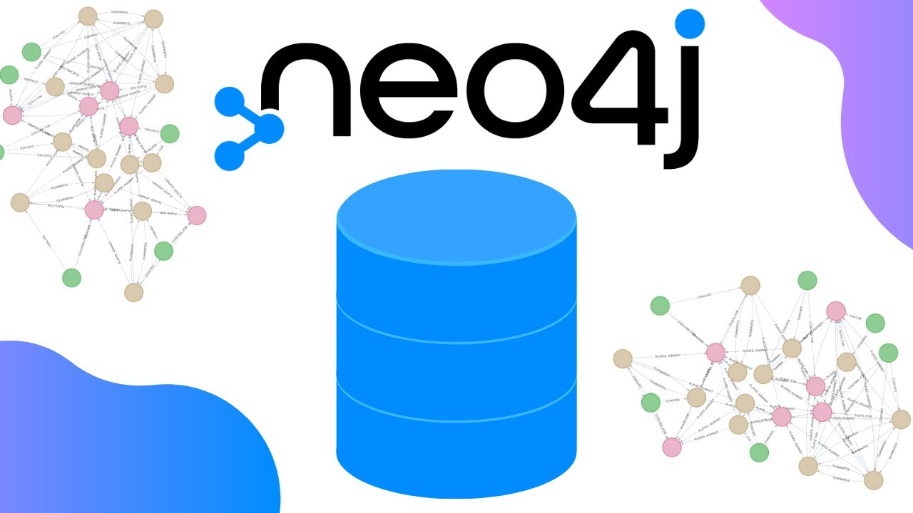
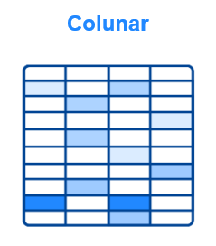
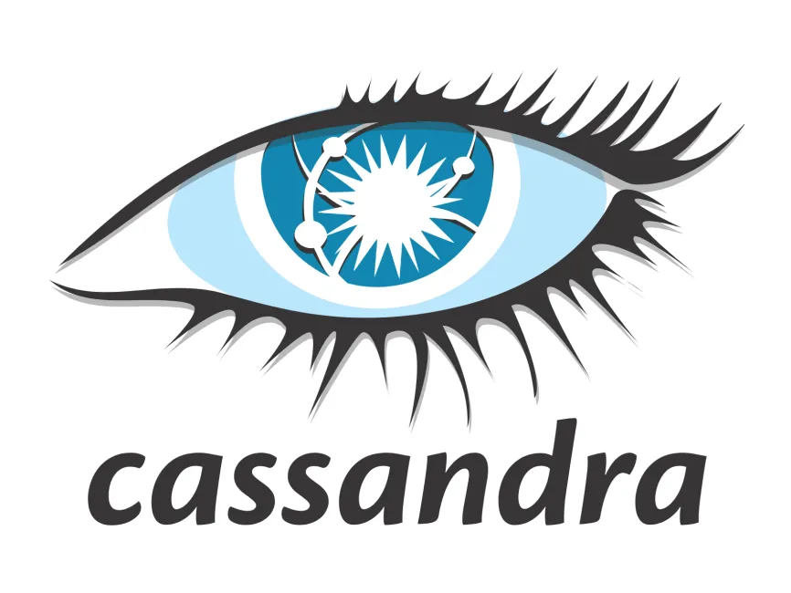
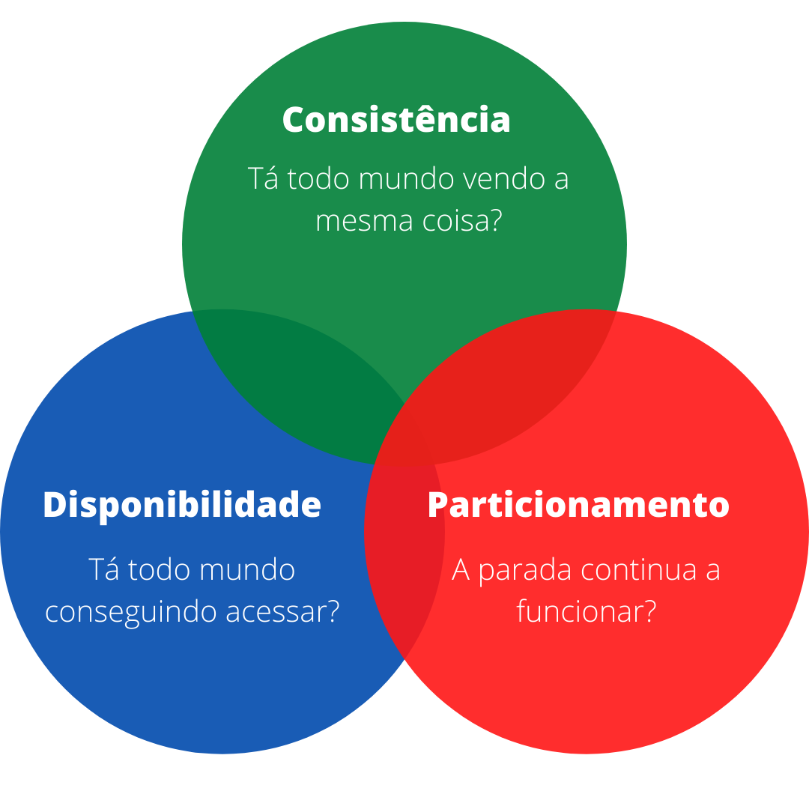

# Resumo de Estudos: Banco de Dados Não Relacional (NoSQL)
**Matéria:** Banco de Dados Não Relacional (EaD) - 3º Semestre

## 1. O que é NoSQL?
O termo **NoSQL** (Not Only SQL) refere-se a uma nova geração de sistemas de gerenciamento de banco de dados que não seguem o modelo relacional tradicional. Eles surgiram para resolver problemas de escalabilidade e flexibilidade que o SQL convencional não conseguia suprir, especialmente com o advento da Web 2.0 e do Big Data.

## 2. Diferenças Fundamentais

### SQL (Relacional)
- **Esquema Rígido:** Tabelas com colunas fixas. Qualquer mudança exige um `ALTER TABLE`.
- **Relacionamentos:** Uso intenso de `JOINs` para conectar dados.
- **Escalabilidade Vertical:** Aumenta-se o poder do hardware (CPU/RAM).
- **Foco:** Integridade e consistência dos dados (Propriedades ACID).  



### NoSQL (Não Relacional)
- **Esquema Flexível (Schemaless):** Os dados podem ser inseridos sem uma estrutura pré-definida.
- **Agregação:** Os dados costumam ser armazenados juntos, evitando a necessidade de `JOINs` complexos.
- **Escalabilidade Horizontal:** Adiciona-se mais servidores baratos em rede (Clusters).
- **Foco:** Performance, alta disponibilidade e volume de dados.  


## 3. Tipos de Bancos de Dados NoSQL

### Documentos
- Armazena dados em formatos como JSON, BSON ou XML.
- É o tipo mais popular por ser muito próximo da estrutura de objetos na programação.
- **Exemplo:** MongoDB.  

 

### Chave-Valor
- Funciona como um dicionário (Hash Table). Para cada chave única, existe um valor.
- Extremamente rápido, usado para cache e gerenciamento de sessões.
- **Exemplo:** Redis.  

 

### Grafos
- Focado nas conexões entre os dados. Utiliza nós e arestas.
- Excelente para redes sociais, sistemas de fraude e recomendações.
- **Exemplo:** Neo4j.  

 

### Colunares (Wide Column)
- Armazena dados em famílias de colunas.
- Otimizado para consultas em conjuntos massivos de dados e analytics.
- **Exemplo:** Cassandra.  

 

## 4. Teorema CAP
Conceito fundamental para entender NoSQL, que diz que um sistema distribuído só pode garantir duas dessas três propriedades simultaneamente:
1. **Consistência (Consistency):** Todos os nós veem os mesmos dados ao mesmo tempo.
2. **Disponibilidade (Availability):** Toda requisição recebe uma resposta (sucesso ou falha).
3. **Tolerância a Partições (Partition Tolerance):** O sistema continua funcionando mesmo se houver falha de comunicação entre os nós.  



## 5. Conclusão de Aplicação
- **Use SQL se:** O sistema exige transações complexas e dados altamente estruturados (Ex: Sistema contábil).
- **Use NoSQL se:** Você precisa de crescimento rápido, lida com dados variados ou precisa de baixíssima latência (Ex: Apps de mensagens, Redes Sociais, IoT).  

# Complemento:

## O que é JSON?
O **JSON** (JavaScript Object Notation) é o formato padrão para armazenamento e troca de informações em bancos de dados orientados a documentos (como o MongoDB).
- **Estrutura:** Baseado em pares de "chave": "valor".
- **Vantagem:** É muito leve, fácil de ler para humanos e fácil de processar para máquinas.
- **Exemplo Prático:**
```json
{
  "aluno": "Estudante de ADS",
  "semestre": 3,
  "materias": ["NoSQL", "Segurança", "Linux"]
}  
```  

## BSON (Binary JSON)  
Este é o formato que o MongoDB usa "por debaixo do capô".  

- Como é: É uma representação binária do JSON. Você não consegue abrir um arquivo BSON no Bloco de Notas e ler ele facilmente como o JSON.

- Vantagem: É otimizado para velocidade e espaço. Ele permite que o banco de dados pule partes do arquivo que não interessam na busca, além de suportar tipos de dados que o JSON não tem (como datas e dados binários brutos).

- Uso: É o formato de armazenamento interno dos bancos NoSQL de documento.  

## XML (eXtensible Markup Language)  

É o "vovô" dos formatos de troca de dados. Se você já viu código HTML, vai achar o XML familiar porque ele também usa tags (como <nome>Eduardo</nome>).  

- Como é: Baseado em tags. É muito rígido e estruturado.

- Vantagem: Muito bom para documentos complexos e altamente hierárquicos. Ainda é muito usado em Notas Fiscais Eletrônicas (NFe) no Brasil e sistemas bancários antigos.

- Ponto Fraco: É muito "pesado" (verboso). Para dizer uma informação simples, você gasta muitos caracteres abrindo e fechando tags.


## Oque é JOIN?  
O JOIN é um dos conceitos mais importantes do SQL (Bancos de Dados Relacionais). Para saber se a "Pessoa A" é amiga da "Pessoa B", o banco tem que procurar em uma tabela gigante, achar o ID de um, o ID de outro e cruzar os dados (o famoso JOIN). Isso gasta muito processamento se a tabela for enorme.  

Os Tipos Mais Comuns de JOIN  
- **INNER JOIN** (O mais usado): Ele traz apenas os registros que possuem correspondência nas duas tabelas. Se uma linha de ônibus não tiver horário cadastrado, ela não aparece.

- **LEFT JOIN**: Ele traz todos os dados da tabela da esquerda (a primeira que você citou no código), mesmo que não haja correspondência na tabela da direita.

    - Exemplo: Ver todas as linhas de ônibus, inclusive aquelas que ainda não têm horários definidos.

- **RIGHT JOIN**: É o contrário do Left. Traz tudo da tabela da direita e o que coincidir da esquerda.

## O que são Grafos?
Diferente das tabelas, o modelo de **Grafos** foca totalmente nos relacionamentos. Imagine uma rede social como o Instagram: o importante não é apenas o seu perfil, mas quem você segue e quem te segue.

- Uso Comum: Redes sociais, sistemas de recomendação (Netflix/Amazon).

## Entidades do Grafo: Nós e Arcos (Relações)

Para entender um banco de dados de grafos (como o Neo4j), você precisa conhecer esses dois termos:

- Nós (Nodes / Vértices): Representam os objetos ou entidades.  
    - Exemplo: Você é um "Nó", e a sua universidade é outro "Nó".  


Entendendo Nós (Nodes) de forma Simples:
- **Definição:** Um Nó é uma "unidade de dado" que representa um objeto real ou abstrato. 
- **Analogia:** Pense em um mapa mental. Cada balãozinho que você desenha é um **Nó**. 
- **O que ele guarda:** Ele armazena as características daquela entidade (ex: Nome, IP, Tipo).
- **Relacionamento:** Os Nós não vivem isolados; eles são conectados por "Arestas" (linhas) que explicam como um Nó interage com o outro.


## Por que NoSQL é tão rápido? (Exemplo Netflix)  
- **Alta Disponibilidade**: O serviço não pode parar.  
- **Escalabilidade Horizontal**: Em vez de comprar um servidor gigante e caro (Escalabilidade Vertical), eles conectam milhares de servidores comuns. Se um milhão de pessoas decidirem assistir a uma série nova ao mesmo tempo, o sistema apenas adiciona mais "nós" à rede para aguentar o tráfego.