# Resumo Detalhado: Segurança da Informação
**Matéria:** Segurança em Sistemas (EaD)

## 1. O que queremos proteger?
A segurança não se resume a apenas "senhas". Queremos proteger o **Sistema de Informação** como um todo, o que inclui:
- **Dados e Informações Valiosas:** Dados pessoais (CPF, RG), financeiros (cartão de crédito) e segredos industriais.
- **Serviços e Processos:** Garantir que o serviço (ex: um site, um banco) continue funcionando sem interrupções.

## 2. A Tríade CIA (Pilar Fundamental)
Um sistema é considerado seguro quando ele garante três princípios básicos:
- **Confidencialidade:** A informação só pode ser acessada por pessoas autorizadas. É o sinônimo de privacidade.
- **Integridade:** Garante que a informação não foi alterada ou destruída de forma não autorizada. O dado deve ser fidedigno.
- **Disponibilidade:** O sistema e a informação devem estar acessíveis sempre que necessário (ex: evitar que o portal da universidade caia no dia de entrega de trabalho).  

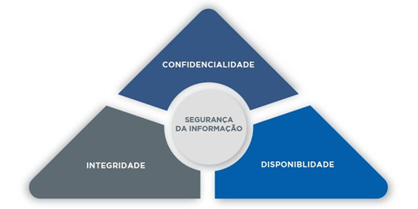

## 3. Ameaça vs. Ataque vs. Vulnerabilidade
- **Vulnerabilidade:** É uma "brecha" ou fraqueza no sistema (ex: um software desatualizado ou uma porta aberta sem necessidade).
- **Ameaça:** É o potencial de que algo ruim aconteça. É um risco que pode ou não se concretizar.
- **Ataque:** É a ação de explorar uma vulnerabilidade para causar dano ou roubar dados.  

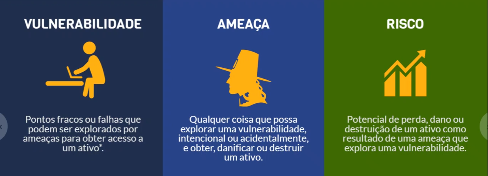

### Tipos de Ataques:
- **Passivo:** O atacante apenas "escuta" ou monitora os dados (intercepção), sem alterá-los. Difícil de detectar. 

    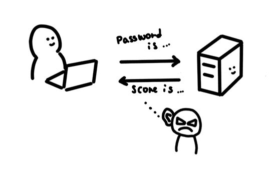  

- **Ativo:** O atacante altera dados, cria mensagens falsas ou interrompe serviços.  

    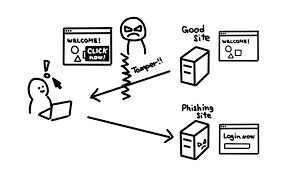

## 4. Tipos de Malware (Softwares Maliciosos)
- **Vírus:** Precisa de um hospedeiro (arquivo) e ação humana para se espalhar.  
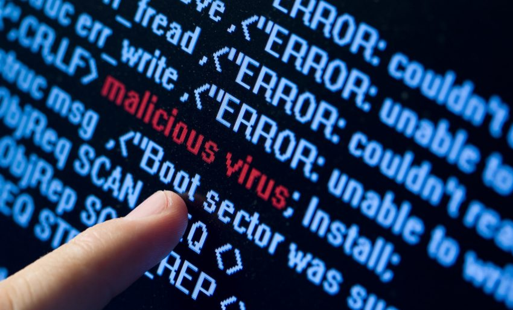  

- **Worm (Verme):** Autônomo, espalha-se sozinho pela rede explorando vulnerabilidades.  
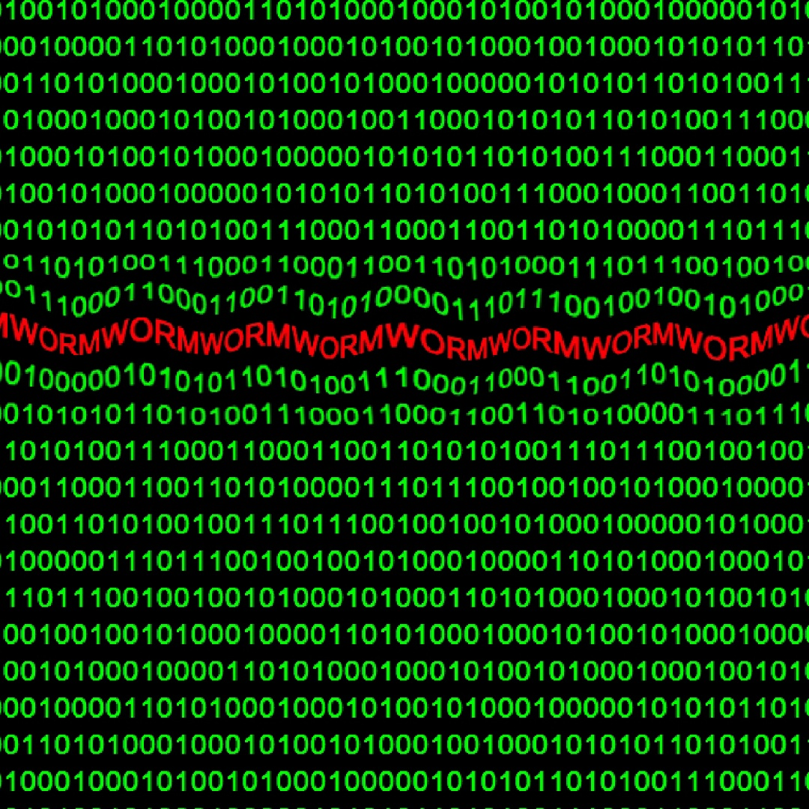  

- **Trojan (Cavalo de Tróia):** Esconde uma função maliciosa dentro de um programa que parece legítimo.  
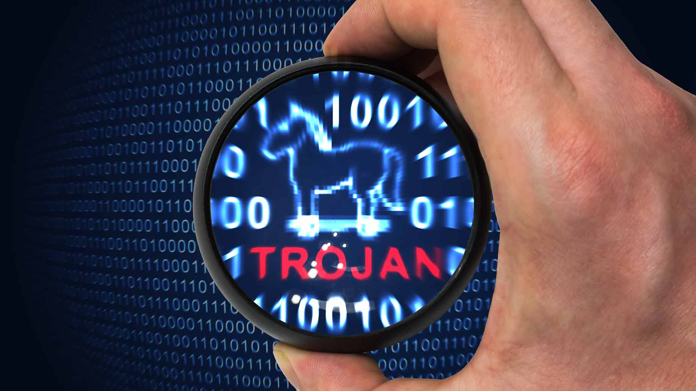

- **Ransomware:** Sequestra dados (criptografa tudo) e exige um resgate (geralmente em criptomoedas).  
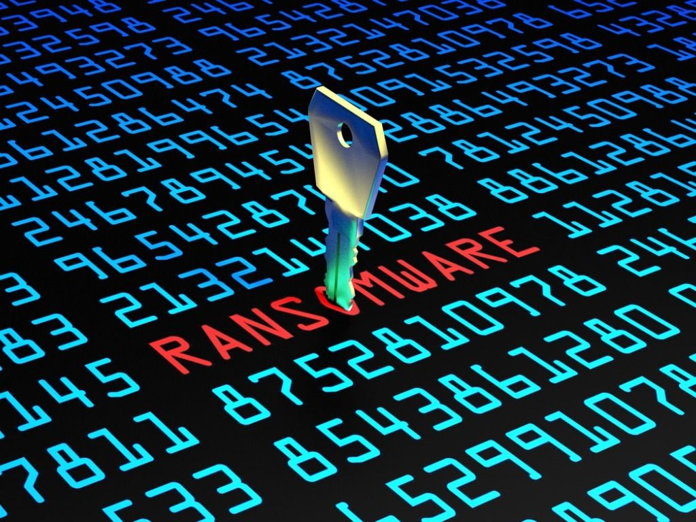

- **Rootkit:** Projetado para esconder a presença de invasores no sistema, operando em níveis profundos do SO.  
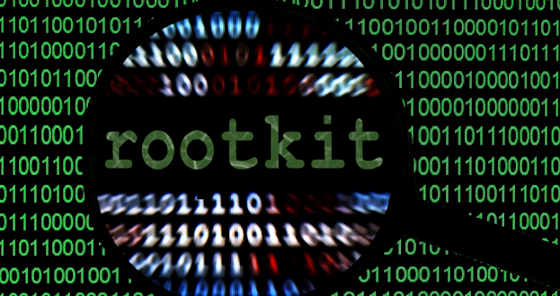

- **Spyware/Keylogger:** Monitora atividades e registra teclas digitadas para roubar senhas.  

- **Botnet:** Rede de computadores "zumbis" controlados remotamente para ataques de negação de serviço (DDoS).  
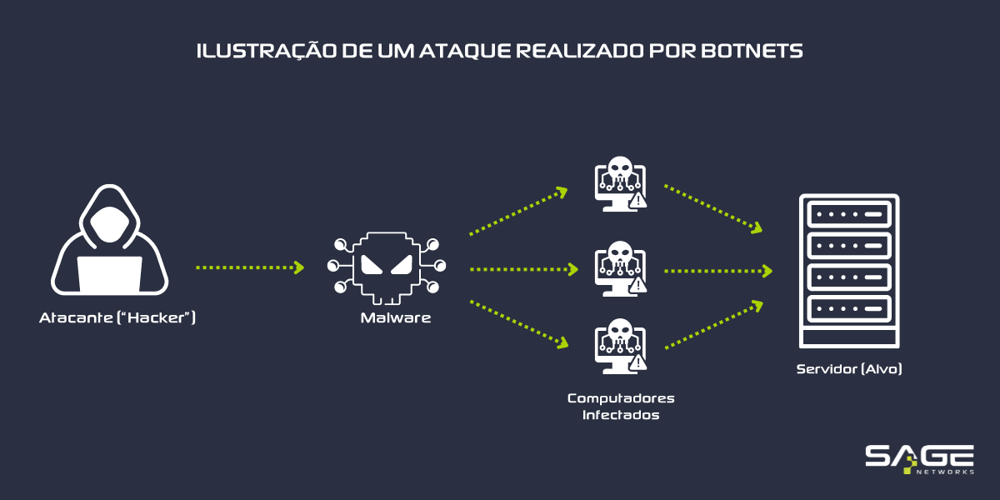  

- **Backdoor:** Um método secreto de contornar a autenticação normal em um computador ou software. É como se o invasor deixasse uma "chave reserva" escondida debaixo do tapete para entrar na casa sempre que quiser, sem precisar arrombar a porta principal.  
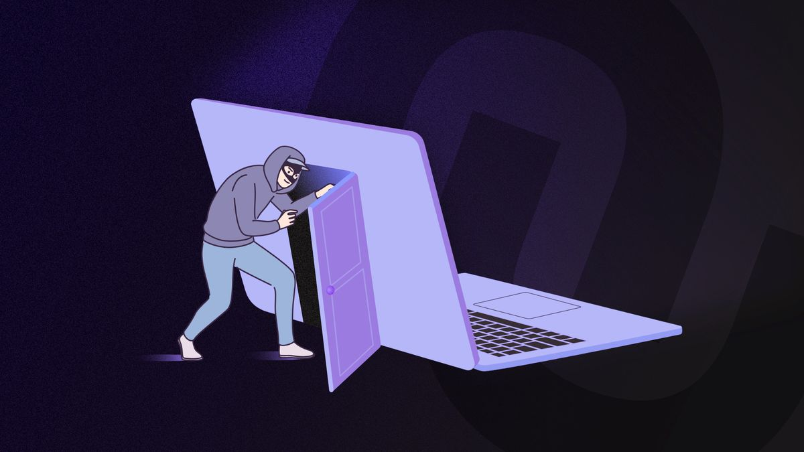

## 5. Engenharia Social e Phishing
- **Engenharia Social:** Ataques baseados na manipulação psicológica de pessoas para obter dados.  

- **Phishing:** A "pesca" de dados através de e-mails, links ou sites falsos que imitam instituições reais.  
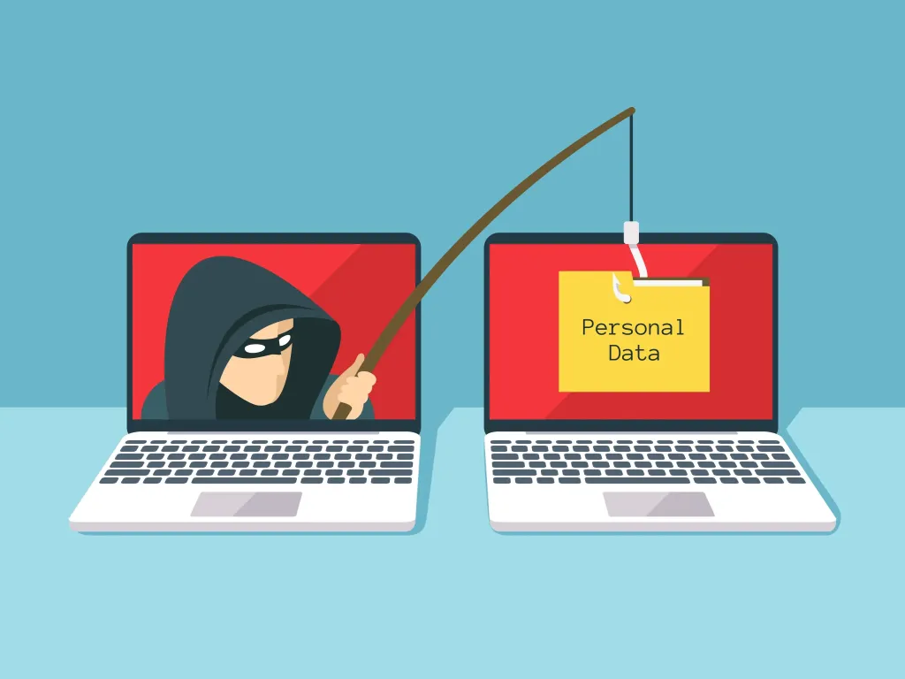

## 6. Ferramentas de Proteção e Prevenção
- **Criptografia:**
    - **Simétrica:** Mesma chave para cifrar e decifrar (mais rápida).
    - **Assimétrica:** Usa um par de chaves (Pública e Privada). Mais segura para comunicações na internet.
- **Firewall:** Barreira que controla o tráfego de rede (entrada e saída) com base em regras de segurança.
- **Certificado Digital:** Identidade eletrônica que garante a autenticidade de quem assina um documento ou acessa um site.
- **Esteganografia:** Técnica de esconder uma informação dentro de outra (ex: um código malicioso dentro de uma imagem aparentemente normal).
- **Autenticação:** Uso de senhas, biometria ou tokens para confirmar a identidade do usuário.

## 7. O Fator Humano
- **Ameaça Interna:** Funcionários ou pessoas com acesso legítimo que, por má intenção ou descuido (ex: andar com crachá visível na rua), comprometem a segurança.
- **Treinamento:** É essencial que todos na organização saibam identificar riscos básicos, como não clicar em links suspeitos.

## 8. Habilidades Necessárias para o Profissional
Para atuar na área, é preciso dominar:
- Redes de Computadores e Protocolos (TCP/IP, SSL/TLS).
- Sistemas Operacionais (Linux/Terminal).
- Programação e Scripts (para automação e análise).
- Bancos de Dados (SQL e NoSQL).
- Escrita Técnica (para geração de relatórios de incidentes).  

### 9. Criminosos Virtuais e Categorias de Hackers
Diferente do que muita gente pensa, o termo "hacker" não define apenas criminosos. Eles são categorizados por "chapéus" que indicam sua ética e intenção:

* **White Hat (Chapéu Branco):** É o hacker ético. Ele usa seu conhecimento para encontrar vulnerabilidades e ajudar empresas a se protegerem. Ele tem permissão para testar os sistemas.
* **Black Hat (Chapéu Preto):** É o criminoso virtual. Ele invade sistemas sem autorização para benefício próprio, lucro ou para causar danos.
* **Grey Hat (Chapéu Cinzento):** Fica no meio termo. Pode invadir um sistema sem permissão, mas sem intenção de causar dano, às vezes apenas para mostrar a falha ao proprietário (embora ainda seja ilegal).  
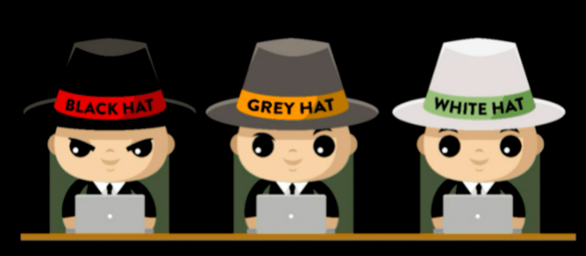

### 10. Ameaça Interna
Um ponto crucial destacado é que o risco nem sempre vem de fora.
- **Definição:** Funcionários, prestadores de serviço ou pessoas com acesso legítimo que podem comprometer a segurança, seja por má intenção ou por erro humano e falta de treinamento.